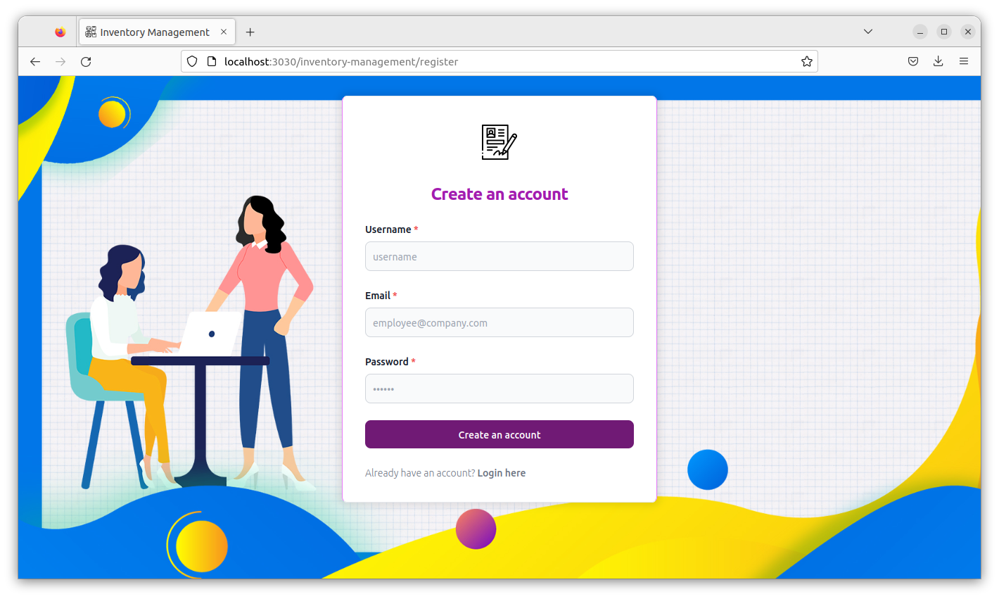
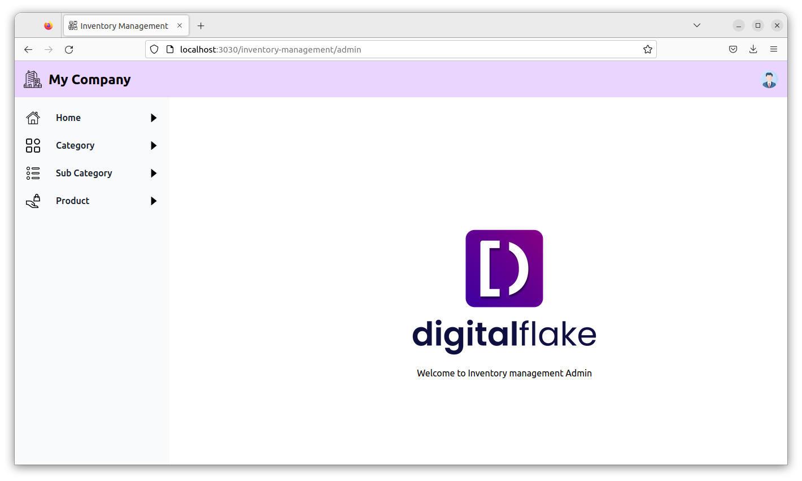
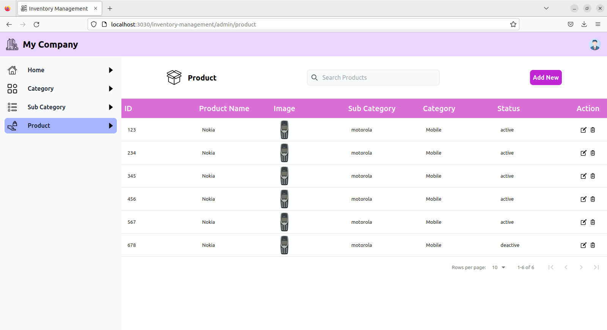
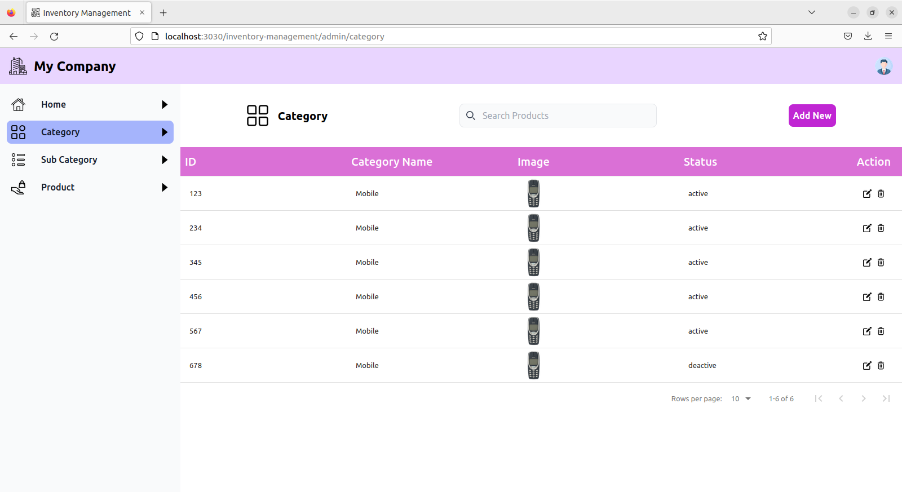

# MERN Stack Order and Inventory Management Application

This project is an order and inventory management application built using the MERN (MongoDB, Express.js, React.js, Node.js) stack. It features user authentication, product management, order processing, inventory management, and statistics generation functionalities.


## Table of Contents
1. [Features](#features)
2. [Folder Structure](#folder-structure)
3. [Setup](#setup)
4. [Backend](#backend)
5. [Frontend](#frontend)
6. [API Documentation](#api-documentation)

## Features
- User authentication with sign-up and login functionality.
- CRUD operations for managing products.
- Place orders and view order history.
- Inventory management with add, remove, and update operations.
- Statistics generation for orders, users, and inventory.

## UI Images
### Landing Page







## Folder Structure
```
inventory-management-MERN /
│
├── backend/
|    │
|    ├── auth-service/
|    │   ├── controllers/
|    │   │   ├── authController.js
|    │   │   └── roleController.js
|    │   ├── models/
|    │   │   └── userModel.js
|    │   ├── routes/
|    │   │   └── authRoutes.js
|    │   ├── middleware/
|    │   │   └── authMiddleware.js
|    │   └── config/
|    │       └── jwtConfig.js
|    │
|    ├── product-service/
|    │   ├── controllers/
|    │   │   └── productController.js
|    │   ├── models/
|    │   │   └── productModel.js
|    │   ├── routes/
|    │   │   └── productRoutes.js
|    │   └── config/
|    │       └── databaseConfig.js
|    │
|    ├── order-service/
|    │   ├── controllers/
|    │   │   └── orderController.js
|    │   ├── models/
|    │   │   └── orderModel.js
|    │   ├── routes/
|    │   │   └── orderRoutes.js
|    │   └── config/
|    │       └── databaseConfig.js
|    │
|    ├── inventory-service/
|    │   ├── controllers/
|    │   │   └── inventoryController.js
|    │   ├── models/
|    │   │   └── inventoryModel.js
|    │   ├── routes/
|    │   │   └── inventoryRoutes.js
|    │   └── config/
|    │       └── databaseConfig.js
|    │
|    ├── statistics-service/
|    │   ├── controllers/
|    │   │   └── statisticsController.js
|    │   ├── models/
|    │   │   └── statisticsModel.js
|    │   ├── routes/
|    │   │   └── statisticsRoutes.js
|    │   └── config/
|    │       └── databaseConfig.js
|    │
|    └── api-gateway/
|        ├── routes/
|        │   ├── authRoutes.js
|        │   ├── productRoutes.js
|        │   ├── orderRoutes.js
|        │   ├── inventoryRoutes.js
|        │   └── statisticsRoutes.js
|        ├── middleware/
|        │   └── authMiddleware.js
|        └── config/
|            └── routeConfig.js
|
│
└── frontend/
    ├── public/
    │
    ├── src/
    │   ├── components/
    │   │   ├── Auth/
    │   │   │   ├── SignIn.jsx
    │   │   │   ├── SignUp.jsx
    │   │   │   
    │   │   ├── Products/
    │   │   │   ├── ProductList.jsx
    │   │   │   ├── ProductItem.jsx
    |   |   |
    │   │   ├── Orders/
    │   │   │   ├── OrderList.jsx
    │   │   │   ├── OrderItem.jsx
    │   │   │   
    │   │   ├── Inventory/
    │   │   │   ├── InventoryList.jsx
    │   │   │   ├── InventoryItem.jsx
    │   │   │   
    │   │   └── Statistics/
    │   │       ├── StatsSummary.jsx
    │   │       ├── UserStats.jsx
    │   │       ├── OrderStats.jsx
    │   │
    │   ├── pages/
    │   │   ├── SignInPage.jsx
    │   │   ├── SignUpPage.jsx
    │   │   ├── ProductsPage.jsx
    │   │   ├── OrdersPage.jsx
    │   │   ├── InventoryPage.jsx
    │   │   ├── StatisticsPage.jsx
    │   │
    │   ├── App.jsx
    │   ├── index.jsx
    │   ├── index.html
    ├── package.json
    ├── package-lock.json
```


## Setup
1. Clone the repository.
    ```bash
    git clone https://github.com/Sam21sop/inventory-management-MERN.git 
2. Navigate to the project directory.
    ```bash 
    cd inventory-management-MERN
3. Install backend dependencies:
    ```bash
    cd backend 
    npm install
4. Install frontend dependencies: 
    ```bash
    cd frontend 
    npm install
5. Start the backend server:
    ```bash
    cd backend
    npm start
6. Start the frontend development server: 
    ```bash
    cd frontend
    npm start
7. Access the application at `http://localhost:3030`.


## Backend
The backend is built with Node.js and Express.js. It handles authentication, CRUD operations for products, order processing, inventory management, and statistics generation.
The backend follows a microservices architecture. Each microservice handles specific functionalities:

### Explanation:
1. **auth-service**: Contains authentication-related functionalities such as sign-up, login, and role management.
2. **product-service**: Manages products and their attributes, including CRUD operations and search functionality.
3. **order-service**: Handles order processing and fulfillment, including placing orders and viewing order details.
4. **inventory-service**: Manages inventory operations such as adding, removing, and updating product inventory.
5. **statistics-service**: Generates statistics related to orders, users, and inventory.
6. **api-gateway**: Acts as a single entry point for clients to access various microservices, routes requests to appropriate services, and handles middleware such as authentication.

### Technology Used
    1. Node.js
    2. Express.js
    3. MongoDB
    4. Mongoose
    6. Json-Web-Token
    7. cors 

### Database Models
The application utilizes MongoDB for its flexibility and scalability. Here are the database models used:

- ***User Model***: Represents user data including name, email, and password.
- ***Product Model***: Stores information about products such as name, description, price, and category.
- ***Order Model***: Contains details about orders including products, quantities, total amount, and status.
- ***Inventory Model***: Tracks inventory levels for products.
- ***Statistics Model***: Stores statistical data related to orders, users, and inventory.

### REST API Endpoints
The backend APIs are structured based on the microservices architecture. Here's a brief overview:

- ***Authentication Service***: Provides endpoints for user sign-up, login, and role management.
- ***Product Service***: Manages products and exposes CRUD operations.
- ***Order Service***: Handles order processing, order placement, and order details.
- ***Inventory Service***: Manages product inventory and provides endpoints for inventory management.
- ***Statistics Service***: Generates statistics related to orders, users, and inventory.

Each service follows a RESTful API design pattern with routes organized based on functionality and resource type. Middleware functions are implemented for authentication, access control, and error handling.


## Frontend
The frontend is developed using React.js. It provides a user interface for interacting with the application, including authentication, product management, order placement, and inventory management.

### Technology Used
    1. React
    2. Vite
    3. Tailwind CSS
    4. Redux Toolkit (RTK)
    5. React-Router

## API Documentation
For detailed API documentation, refer to the [API Documentation](API_DOCUMENTATION.md) file.

